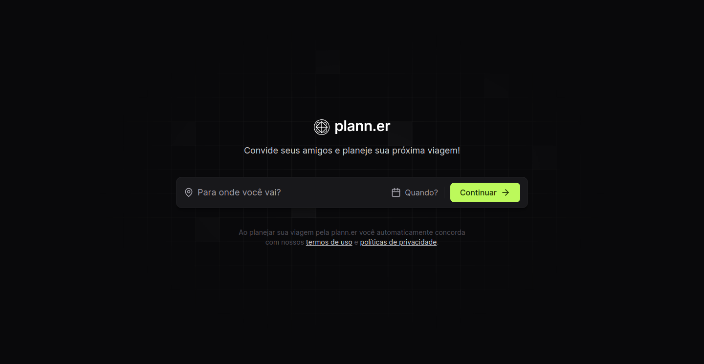
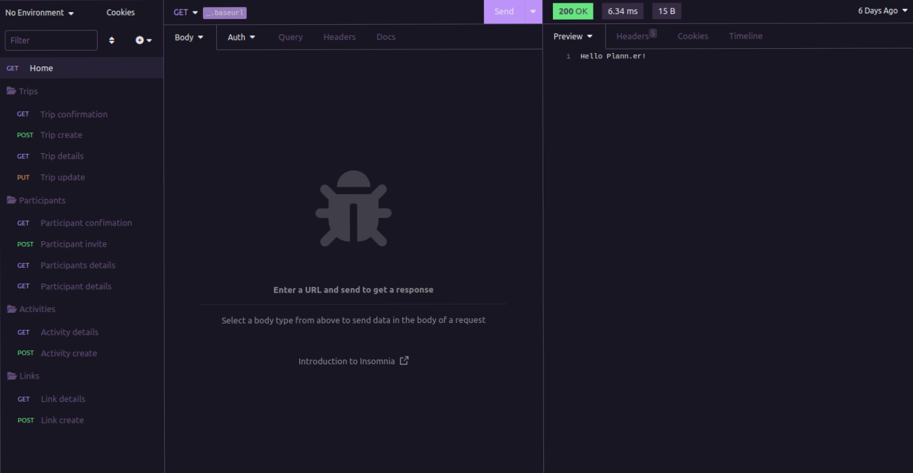

<h1 align="center">Plann.er
  <br/>
  
  
  <br/>
</h1>

[](https://github.com/LeoMSSilva)
[](https://github.com/LeoMSSilva)
[](#)
[](https://github.com/LeoMSSilva/plann.er/stargazers)
[](https://github.com/LeoMSSilva/plann.er/network/members)
[](https://github.com/LeoMSSilva/plann.er/graphs/contributors)

---

# :pushpin: Table of Contents

- :house: [About](#house-about)
- :dart: [Installation](#dart-installation)
  - :gear: [Install dependencies](#hammer_and_wrench-install-dependencies)
  - :rocket: [Getting started](#rocket-getting-started)
- :computer: [Techs](#computer-techs)
- :bust_in_silhouette: [Author](#bust_in_silhouette-author)
- :handshake: [Contributing](#handshake-contributing)
- :scroll: [License](#scroll-license)

---

# :house: About

This application is used to create a complete agenda for a trip, including its activities, participants and important links. It has confirmation emails for the trip and its participants, as well as notifications of updates to the data registered for the trip.

#### ***To the front-end:***

**Vite** to manage the entire application.

**Vitejs plugin react swc** to speed up the build and auto reload in dev of the application.

**Typescript** as a programming language used through the **reactJs** framework and transpiled to **javascript**.

**React dom** to route application navigation.

**React router dom** with **localforage**, **match sorter** and **sort by** to create application navigation.

**Axios** to make requests to the application back-end.

**Date fns** to format dates.

**React day picker** to use date picker component.

**TailwindCss** together with **postcss** and **autoprefixer** to style the web application.

**Tailwind variants** to create variables in styled components using Tailwind.

**Lucide react** for icon use in react.

#### ***To the back-end:***

**Typescript** as a programming language used through the **nodeJs** framework and transpiled to **javascript**.

**Fastify** as a server and **fastify cors** for cors configuration.

**Tsx** to manage all the auto-reloading of the application in the application dev.

**Tsup** to speed up the build.

**Zod** along with the **fastify type provider zod** to perform validations on routes and environment variables.

**Prisma** and **prisma client** to connect and use the database in the application.

**Nodemailer** to send emails.

**DayJs** to format dates.

#### ***Common to the project:***

**BiomeJs** for formatting and linting the code.

**Husky** and **lint-staged** to automate tasks during git flow.

#### ***Access the project:***

The front-end via the **[link](plann-er-leomssilva.vercel.app)**.

The back-end via the **[link](#)**.

---

# :dart: Installation

**First you need to install:**

- [Node.js](https://pt-br.nodejs.org/) (required)
- [Yarn](https://yarnpkg.com/) (optional)

**Then in order, clone the project.**

By HTTPS, running this command:

```bash
  git clone https://github.com/LeoMSSilva/plann.er.git
```

Or by ssh, running this command:

```bash
  git clone git@github.com:LeoMSSilva/plann.er.git
```

SSH is a secure protocol, but you need to register a key ssh in your github before.

## :hammer_and_wrench: Install dependencies

```bash
  yarn
```

or

```bash
  yarn install
```

## :rocket: Getting Started

To run the *front-end* use:

```bash
  cd web
```

Or to run the *back-end* use:

```bash
  cd server
```

After being in the folder, run the following command to start the project:

```bash
  yarn dev
```

---

# :computer: Techs

- Autoprefixer
- Axios
- BiomeJs
- Date fns
- DayJs
- Fastify
- Fastify cors
- Fastify Type Provider Zod
- Javascript
- Husky
- Lint-staged
- Localforage
- Lucide React
- Match sorter
- Nodemailer
- Postcss
- Prisma
- Prisma Client
- React day picker
- React Dom
- React router dom
- ReactJs
- Sort by
- TailwindCss
- Tailwindcss Variants
- Tsup
- Tsx
- Typescript
- Vite
- Vitejs Plugin React SWC
- Zod

---

# :bust_in_silhouette: Author

**LeoMSSilva**

- Github: [@LeoMSSilva](https://github.com/LeoMSSilva)
- LinkedIn: [@LeoMSSilva](https://linkedin.com/in/LeoMSSilva)

---

# :handshake: Contributing

Contributions, issues and feature requests are welcome! Feel free to **file a new issue** on the [plann.er](https://github.com/LeoMSSilva/plann.er/issues) repository. If you already found a solution to your problem, **I would love to review your pull request**!

---

# :scroll: License

Copyright :copyright: 2024 [LeoMSSilva](https://github.com/LeoMSSilva).
<br/>
This project is [MIT](https://github.com/LeoMSSilva/plann.er/blob/main/LICENSE) licensed.

---
